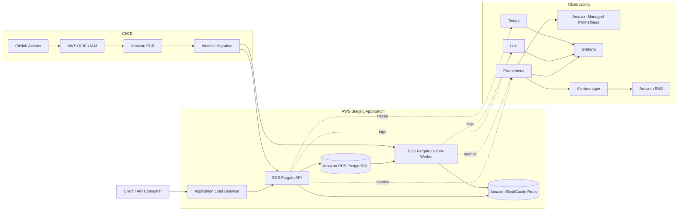
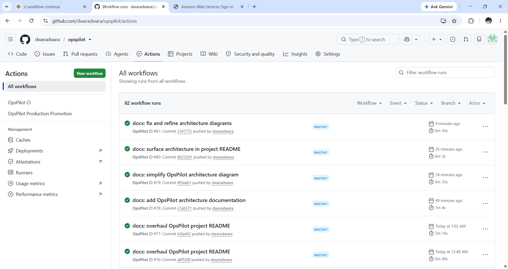
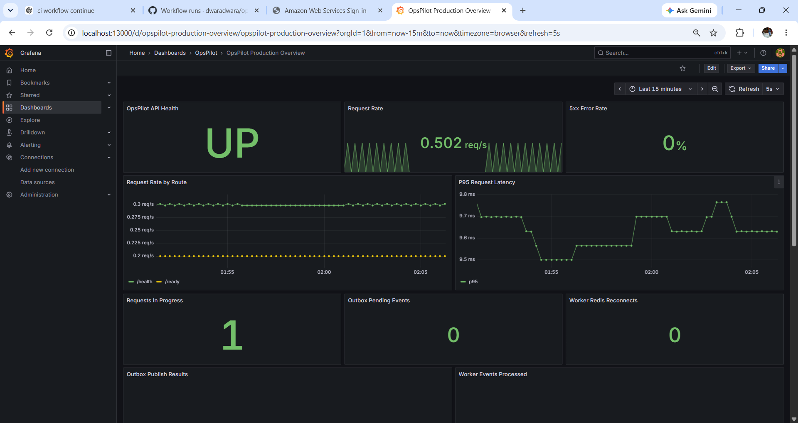
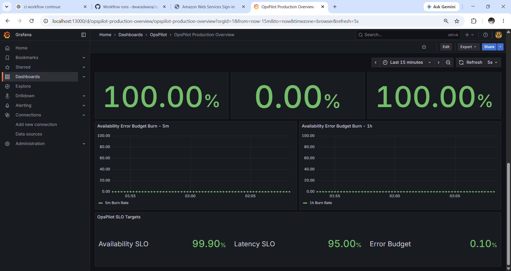
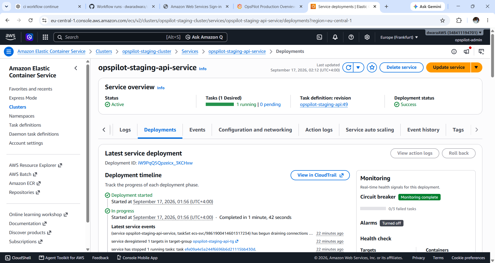
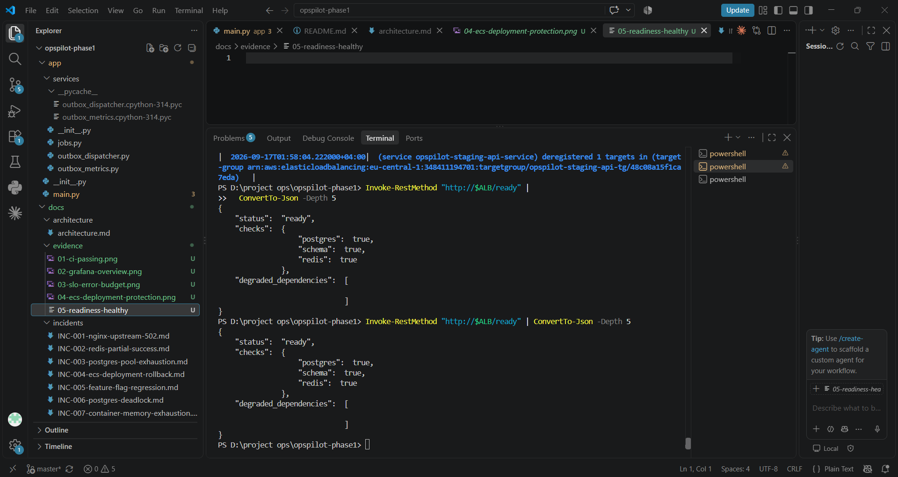
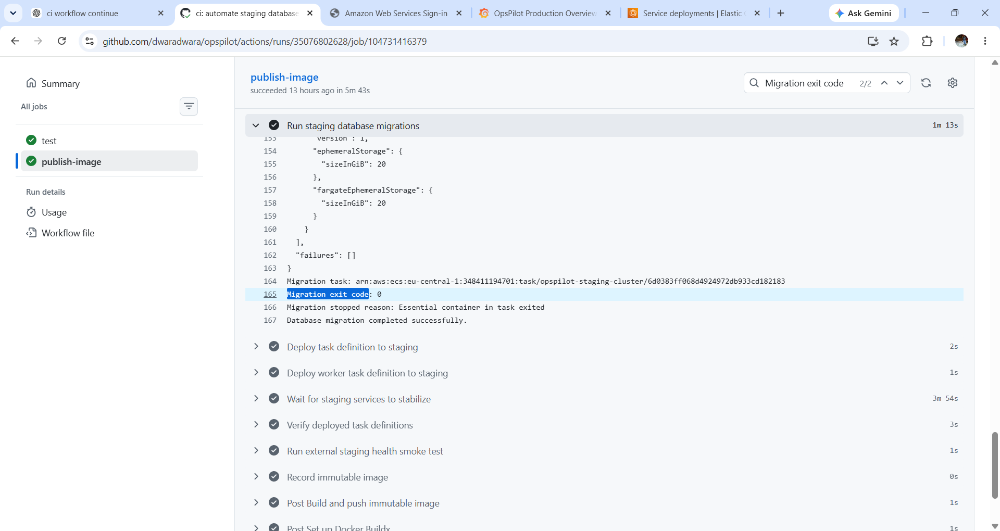
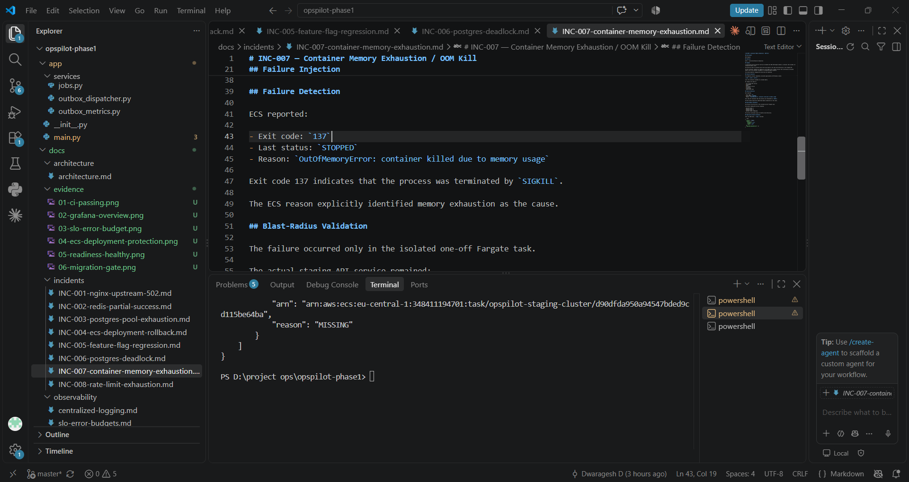

<div align="center">

# 🚦 OpsPilot

### Production Support & Reliability Engineering on AWS

A production-style SaaS workload built to demonstrate  
**cloud operations, observability, incident response, deployment safety, and reliability engineering.**

<br>

[](https://github.com/dwaradwara/opspilot/actions/workflows/ci.yml)


<br>

**CI Passing** · **AWS Staging Deployed** · **8 Incident Drills** · **3 Operational Runbooks**

</div>

---

## Overview

OpsPilot is a production-support and reliability engineering project built around a multi-tenant SaaS API running in an AWS staging environment.

The application is intentionally used as a workload for practicing the type of engineering performed in:

**Technical Support · Production Support · Cloud Support · Application Support · SRE / Reliability Engineering**

The focus is not only on building the application, but on operating it:

- deploying immutable releases
- monitoring service health and dependencies
- troubleshooting application and infrastructure failures
- validating database migrations before deployment
- handling Redis and PostgreSQL failure scenarios
- protecting deployments with ECS health checks and rollback
- measuring SLOs and error budgets
- injecting controlled failures
- documenting incidents and operational recovery

> **OpsPilot is not a CRUD-only demo.**
> It is an operational engineering environment designed around troubleshooting, reliability, and production-support workflows.

---

## At a Glance

| Area | Implementation |
|---|---|
| **Cloud Platform** | AWS ECS Fargate, ALB, RDS, ElastiCache, ECR |
| **Infrastructure** | Terraform |
| **Application** | FastAPI, Python, SQLAlchemy |
| **Database** | PostgreSQL + Alembic |
| **Async Processing** | Redis + transactional outbox |
| **Observability** | Prometheus, Grafana, Loki, Tempo, OpenTelemetry |
| **Reliability** | SLOs, error budgets, retries, timeouts, circuit breakers |
| **CI/CD** | GitHub Actions + AWS OIDC + immutable SHA deployments |
| **Deployment Safety** | Migration gate, health checks, ECS circuit breaker |
| **Incident Engineering** | 8 controlled failure scenarios |
| **Operations** | Runbooks, readiness checks, structured logging |

---

## Quick Navigation

<div align="center">

[**Architecture**](#architecture) ·
[**AWS Staging**](#aws-staging-architecture) ·
[**Observability**](#observability-architecture) ·
[**CI/CD**](#cicd) ·
[**Incidents**](#incident-engineering) ·
[**Evidence**](#operational-evidence) ·
[**Runbooks**](#operational-runbooks)

</div>

---

## Architecture



## What OpsPilot Demonstrates

OpsPilot currently demonstrates:

- Multi-tenant FastAPI application design
- JWT authentication and role-based access control
- PostgreSQL persistence with SQLAlchemy and Alembic
- Redis-backed asynchronous processing
- Transactional outbox pattern
- Retry, timeout, exponential backoff, and circuit-breaker behavior
- AWS ECS Fargate application and worker services
- Application Load Balancer health checking
- Amazon RDS PostgreSQL
- Amazon ElastiCache for Redis
- Amazon ECR immutable image deployments
- AWS Secrets Manager integration
- Terraform infrastructure as code
- GitHub Actions CI/CD using AWS OIDC
- Database migration gating before deployment
- ECS deployment circuit breaker and automatic rollback
- Prometheus metrics
- Amazon Managed Service for Prometheus remote storage
- Grafana dashboards
- Loki centralized logging
- OpenTelemetry tracing with Tempo
- Blackbox synthetic monitoring
- Alertmanager and Amazon SNS alert delivery
- SLOs, SLIs, error budgets, and multi-window burn-rate alerts
- Health and dependency-aware readiness checks
- Structured JSON logging and request correlation
- Controlled failure injection
- Incident documentation and operational runbooks

---

## AWS Staging Architecture

```text
                              GitHub Actions
                                   |
                         OIDC -> AWS IAM Role
                                   |
                    Test -> Build -> ECR -> Deploy
                                   |
                                   v
+----------------+        +---------------------+
|     Client     | -----> | Application Load    |
|                |        | Balancer            |
+----------------+        +----------+----------+
                                    |
                                    v
                         +---------------------+
                         | ECS Fargate         |
                         | OpsPilot API        |
                         | FastAPI             |
                         +----+-----------+----+
                              |           |
                    SQL       |           | Redis
                              |           |
                              v           v
                       +-----------+  +----------------+
                       | Amazon    |  | ElastiCache    |
                       | RDS       |  | Redis          |
                       | PostgreSQL|  +--------+-------+
                       +-----+-----+           |
                             |                 |
                             |                 v
                             |        +----------------+
                             +------> | ECS Fargate    |
                                      | Outbox Worker  |
                                      +----------------+
```

The API and worker use the same immutable application image but run as separate ECS services.

Ticket creation writes both application data and notification intent into PostgreSQL. The background dispatcher later publishes pending events to Redis. This allows ticket persistence to succeed even when Redis is temporarily unavailable.

---

## Observability Architecture

```text
OpsPilot API / Worker
       |
       +---------------- Structured logs ----------------+
       |                                                 |
       |                                              FireLens
       |                                                 |
       |                                                 v
       |                                               Loki
       |
       +---------------- OpenTelemetry -----------------> Tempo
       |
       +---------------- /metrics ----------------------> Prometheus
                                                           |
                                                           +--> Amazon Managed
                                                           |    Prometheus
                                                           |
                                                           +--> Alert Rules
                                                                  |
                                                                  v
                                                             Alertmanager
                                                                  |
                                                                  v
                                                               AWS SNS

Blackbox Exporter ---> external /health probe

Grafana ---> Prometheus / AMP / Loki / Tempo
```

The observability stack includes:

- Prometheus
- Grafana
- Loki
- Tempo
- OpenTelemetry
- Blackbox Exporter
- Alertmanager
- Amazon Managed Service for Prometheus
- Amazon SNS
- CloudWatch logs for supporting infrastructure
- S3-backed Loki and Tempo storage

Grafana provides both operational overview and SLO/error-budget dashboards.

---

## Reliability Model

OpsPilot separates basic process health from dependency-aware readiness.

### Health

```text
GET /health
```

Confirms that the API process is alive.

### Readiness

```text
GET /ready
```

Validates critical application dependencies including:

- PostgreSQL connectivity
- expected database schema revision
- Redis connectivity

This distinction is used during incident investigation to determine whether the process itself is alive while one of its dependencies is degraded.

---

## SLOs and Error Budgets

The staging environment includes service-level reliability measurements.

Current targets include:

| Objective | Target |
|---|---:|
| Availability | 99.9% |
| Latency | 95% of requests under 500 ms |

Prometheus recording rules calculate availability, error rate, latency compliance, and error-budget consumption.

OpsPilot also implements multi-window burn-rate alerting so alerts are based on sustained reliability impact rather than individual HTTP failures.

Alert rules are validated automatically in CI with `promtool`.

---

## Resilient Event Delivery

Ticket notification processing uses a transactional outbox architecture.

```text
API request
   |
   v
PostgreSQL transaction
   |
   +--> ticket
   |
   +--> outbox event
           |
           v
     Outbox dispatcher
           |
       retry/backoff
           |
      circuit breaker
           |
           v
          Redis
```

If Redis becomes unavailable:

1. the ticket can still be persisted;
2. the outbox event remains pending in PostgreSQL;
3. publishing is retried with bounded exponential backoff;
4. repeated Redis failures open the circuit breaker;
5. after Redis recovery, pending events can be published again.

This behavior was validated through controlled staging failure injection.

---

## CI/CD

GitHub Actions runs automatically on pushes and pull requests targeting `master`.

The pipeline performs:

```text
Prometheus rule validation
        |
        v
isolated Docker test environment
        |
        v
immutable image build
        |
        v
Amazon ECR :<git-sha>
        |
        v
new API + worker task definitions
        |
        v
one-off Alembic migration task
        |
   migration succeeds?
      /          \
    no            yes
    |              |
 deployment       v
  blocked      ECS deployment
                   |
                   v
          wait for stabilization
                   |
                   v
          external health smoke test
```

AWS authentication from GitHub uses OIDC rather than long-lived AWS access keys.

Container images are deployed using the exact Git commit SHA as the ECR image tag.

Database migrations must succeed before staging deployment proceeds.

The API and worker are both verified after deployment.

---

## Automated Tests

The repository contains an isolated Docker Compose test environment with dedicated PostgreSQL and Redis services.

Coverage includes:

- tenant isolation
- authorization and RBAC
- health and readiness behavior
- database timeout behavior
- database error metrics
- structured logging
- feature-flag behavior
- outbox resilience
- Redis circuit-breaker behavior

Run the test environment with:

```bash
docker compose -f docker-compose.test.yml up \
  --build \
  --abort-on-container-exit \
  --exit-code-from api_test
```

Clean up with:

```bash
docker compose -f docker-compose.test.yml down -v
```

---

## Incident Engineering

Controlled failure injection is performed only in staging or isolated one-off tasks.

Eight production-style incidents have been executed and documented.

| Incident | Scenario | Engineering Focus |
|---|---|---|
| [INC-001](docs/incidents/INC-001-nginx-upstream-502.md) | Nginx upstream 502 | proxy/upstream diagnosis |
| [INC-002](docs/incidents/INC-002-redis-partial-success.md) | Redis outage and partial success | transactional outbox and recovery |
| [INC-003](docs/incidents/INC-003-postgres-pool-exhaustion.md) | PostgreSQL pool exhaustion | connection-pool monitoring and recovery |
| [INC-004](docs/incidents/INC-004-ecs-deployment-rollback.md) | Failed ECS deployment | ALB health checks and automatic rollback |
| [INC-005](docs/incidents/INC-005-feature-flag-regression.md) | Feature-flag regression | functional failure hidden behind healthy infrastructure |
| [INC-006](docs/incidents/INC-006-postgres-deadlock.md) | PostgreSQL deadlock | locking, concurrency, and deadlock recovery |
| [INC-007](docs/incidents/INC-007-container-memory-exhaustion.md) | Container memory exhaustion | OOM diagnosis and blast-radius isolation |
| [INC-008](docs/incidents/INC-008-rate-limit-exhaustion.md) | HTTP 429 rate limiting | throttling diagnosis and automatic recovery |

Each incident follows the same operational pattern:

```text
detect
-> investigate
-> identify failure domain
-> mitigate
-> validate recovery
-> document evidence
```
---

## Operational Evidence

Selected evidence from the deployed AWS staging environment and completed reliability exercises.

<table>
<tr>
<td width="50%" valign="top">

### CI/CD Pipeline



GitHub Actions CI runs passing on the `master` branch.

</td>
<td width="50%" valign="top">

### Service Observability



Grafana overview showing API health, request rate, latency, errors, and worker metrics.

</td>
</tr>

<tr>
<td width="50%" valign="top">

### SLOs and Error Budgets



Availability, latency compliance, error-budget targets, and burn-rate monitoring.

</td>
<td width="50%" valign="top">

### ECS Deployment Protection



ECS service deployment with circuit-breaker monitoring and target health protection.

</td>
</tr>

<tr>
<td width="50%" valign="top">

### Dependency-Aware Readiness



`/ready` validating PostgreSQL, schema revision, and Redis connectivity.

</td>
<td width="50%" valign="top">

### Database Migration Gate



Alembic migration task completing with exit code `0` before ECS deployment proceeds.

</td>
</tr>

<tr>
<td width="50%" valign="top">

### Container Memory Exhaustion



Documented INC-007 result: exit code `137`, container `STOPPED`, and ECS `OutOfMemoryError`.

</td>
<td width="50%" valign="top">

### Incident Documentation

Eight controlled failure scenarios are documented under [`docs/incidents`](docs/incidents), with operational runbooks under [`docs/runbooks`](docs/runbooks).

</td>
</tr>
</table>

---

## Operational Runbooks

Formal runbooks currently include:

| Runbook | Purpose |
|---|---|
| [HTTP 502 Upstream Failure](docs/runbooks/http-502-upstream-failure.md) | diagnose reverse-proxy/upstream failures |
| [PostgreSQL Pool Exhaustion](docs/runbooks/postgres-pool-exhaustion.md) | investigate pool saturation and database connectivity |
| [Redis Outage / Outbox Recovery](docs/runbooks/redis-outage-outbox-recovery.md) | diagnose delayed asynchronous processing and safely validate recovery |

Additional observability documentation:

- [Centralized Logging](docs/observability/centralized-logging.md)
- [SLOs and Error Budgets](docs/observability/slo-error-budgets.md)

---

## Application Security

Every user belongs to an organization.

Application queries are scoped using the authenticated user's organization, preventing cross-tenant access to ticket data.

Roles include:

- `owner`
- `agent`
- `user`

Organization owners can create members. Lower-privileged roles cannot perform owner-only membership operations.

Automated tests validate cross-tenant isolation and role enforcement.

Secrets such as the database password and JWT signing secret are provided to ECS through AWS Secrets Manager rather than committed to the repository.

---

## Rate Limiting

OpsPilot includes Redis-backed per-client request limiting.

Default configuration:

```text
60 requests / 60 seconds
```

When a client exceeds the quota, the API returns:

```text
HTTP 429 Too Many Requests
X-RateLimit-Limit
X-RateLimit-Remaining
Retry-After
```

Health, readiness, and metrics endpoints are excluded so operational monitoring remains available during client throttling.

---

## Database Reliability

Database safeguards include:

- connection-pool metrics
- bounded connection acquisition timeout
- PostgreSQL statement timeout
- database error metrics
- schema revision validation
- indexed ticket query path
- Alembic migration management
- automated migration execution before deployment

A slow-query exercise also validated index-based query optimization before the incident-testing phase.

---

## Technology Stack

| Area | Technology |
|---|---|
| API | FastAPI |
| Language | Python |
| Database | PostgreSQL / Amazon RDS |
| ORM | SQLAlchemy |
| Migrations | Alembic |
| Cache / Queue | Redis / Amazon ElastiCache |
| Worker | Python outbox dispatcher |
| Containers | Docker / AWS ECS Fargate |
| Load Balancing | AWS Application Load Balancer |
| Registry | Amazon ECR |
| Infrastructure | Terraform |
| Secrets | AWS Secrets Manager |
| CI/CD | GitHub Actions + AWS OIDC |
| Metrics | Prometheus + Amazon Managed Prometheus |
| Dashboards | Grafana |
| Logs | Loki + FireLens / Fluent Bit |
| Tracing | OpenTelemetry + Tempo |
| Synthetic Monitoring | Blackbox Exporter |
| Alerting | Alertmanager + Amazon SNS |
| Testing | Pytest + Docker Compose |

---

## Local Development

Create the environment file:

```bash
cp .env.example .env
```

Replace example secrets with local development values.

Start the stack:

```bash
docker compose up --build -d
```

Check containers:

```bash
docker compose ps
```

Application health:

```text
http://localhost:8080/health
```

API documentation:

```text
http://localhost:8080/docs
```

Stop the environment:

```bash
docker compose down
```

---

## Repository Structure

```text
opspilot/
├── app/                         FastAPI application and application services
├── worker/                      Redis event consumer and worker metrics
├── alembic/                     database migrations
├── tests/                       automated test suite
├── infra/terraform/             AWS infrastructure as code
├── monitoring/                  Prometheus, Grafana, Loki, Tempo and alerting
├── nginx/                       local reverse-proxy configuration
├── docs/                        architecture, incidents, runbooks and evidence
├── scripts/                     environment verification utilities
├── .github/workflows/           CI/CD pipeline
├── Dockerfile
├── docker-compose.yml
├── docker-compose.staging.yml
└── docker-compose.test.yml
```

---

## Engineering Rule

Production-style reliability testing must have a controlled blast radius.

Destructive tests, dependency failures, bad deployment simulations, resource exhaustion, and other failure-injection exercises belong in staging or isolated test tasks.

The purpose is to learn how systems fail without treating uncontrolled breakage as engineering.

---

## Project Status

OpsPilot has completed its main engineering and incident-validation phases.

Current completed areas include:

```text
application foundation
security and tenant isolation
AWS staging infrastructure
CI/CD
database migrations
observability
centralized logging
distributed tracing
synthetic monitoring
SLOs and error budgets
alerting
dependency resilience
operational runbooks
eight controlled incident drills
```


---

## Why This Project Exists

OpsPilot was built to practice the gap between writing software and supporting software in production-like conditions.

The central question is not:

> "Can the API return a successful response?"

It is:

> "When the system fails, can the failure be detected, isolated, explained, recovered safely, and prevented from becoming harder to diagnose next time?"

That is the engineering problem OpsPilot is designed to demonstrate.
