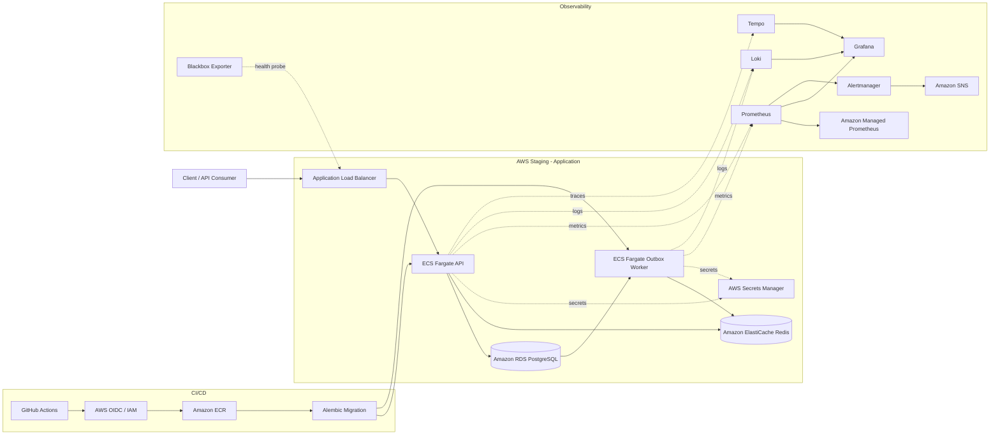

# OpsPilot Architecture

OpsPilot is a production-support and reliability engineering platform operated in an AWS staging environment.

The architecture is designed to demonstrate application delivery, dependency resilience, observability, incident response, and controlled failure testing.

## System Architecture

